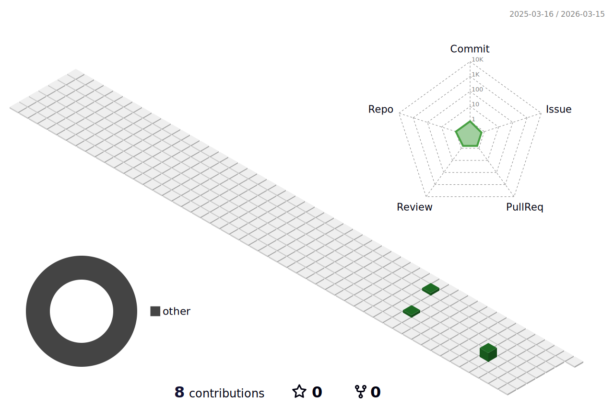

<h3 align="center"> 안녕하세요 👋 </h3>
<h2 align="center"> 논리적인 개발을 사랑하는 개발자 이찬우입니다!</h2>

 저는 코드부터 시스템 아키텍처까지, 소프트웨어 개발의 모든 측면에 깊이 몰두하며

 항상 최신 기술 동향을 주시하고, 효율적이고 안정적인 코드를 작성하기 위해 노력합니다.

 팀과 협력하여 프로젝트를 성공적으로 완수하는 것을 목표로 삼고 있으며, 

 끊임없는 자기 계발과 학습을 통해 더 나은 개발자로 성장하고자 항상 노력하고 있고 이를 통해 미래의 도전과 기회에 대비하고 있습니다.

---

<h3 align="center"> 기술 Stack </h3>

  
  
  
  
  
  

 

  
  
  
<!--    -->

 

  
  
  
   
  
  
  
  

 

  
  
  
  
  
  

  
  
  

 

  
  
  
  

 
<h5 align="center"> 협업툴 </h5>

  
  
  
  
  

 
 
 

  

  

<!--
**LChanwoo/LChanwoo** is a ✨ _special_ ✨ repository because its `README.md` (this file) appears on your GitHub profile.
Here are some ideas to get you started:

- 🔭 I’m currently working on ...
- 🌱 I’m currently learning ...
- 👯 I’m looking to collaborate on ...
- 🤔 I’m looking for help with ...
- 💬 Ask me about ...
- 📫 How to reach me: ...
- 😄 Pronouns: ...
- ⚡ Fun fact: ...
-->

  
  

